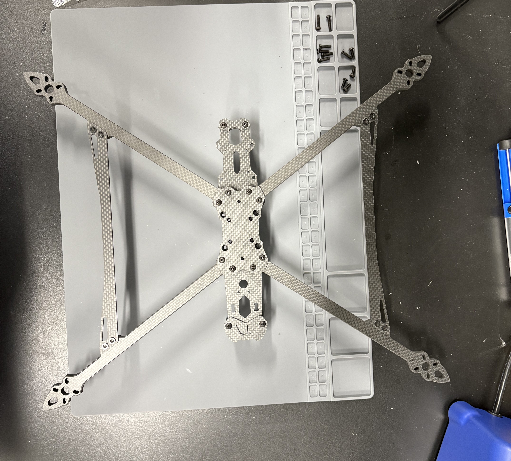
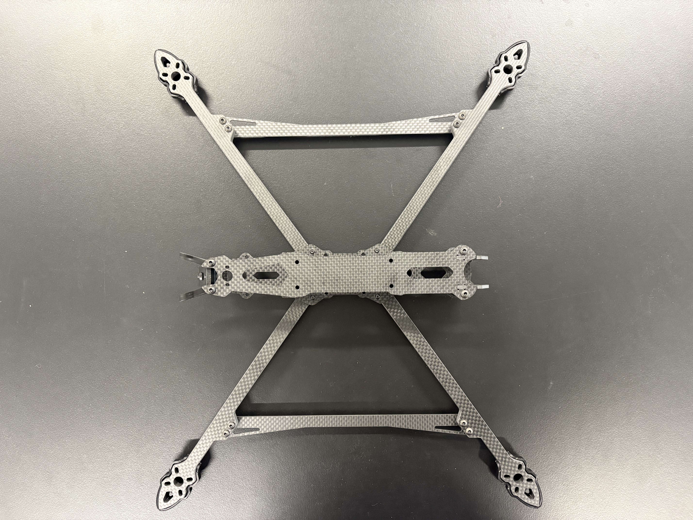
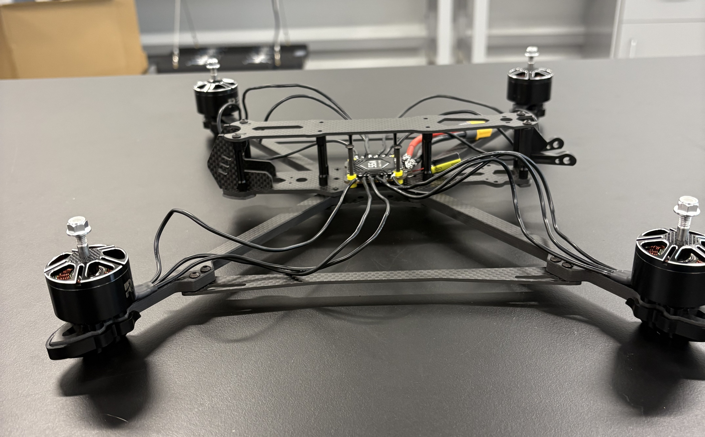
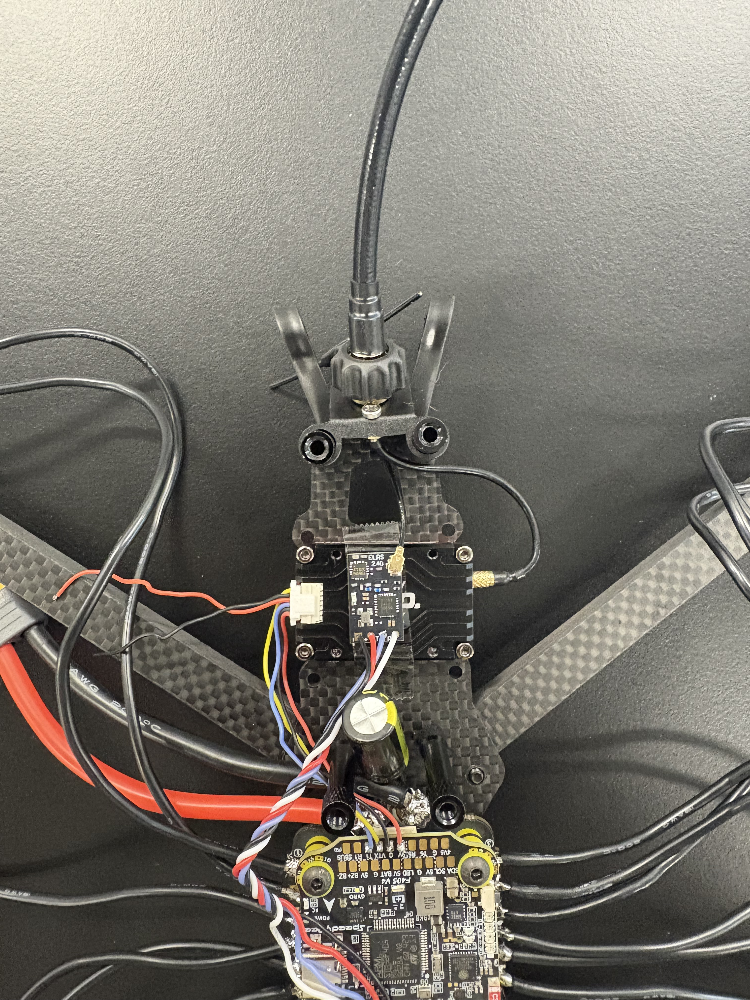
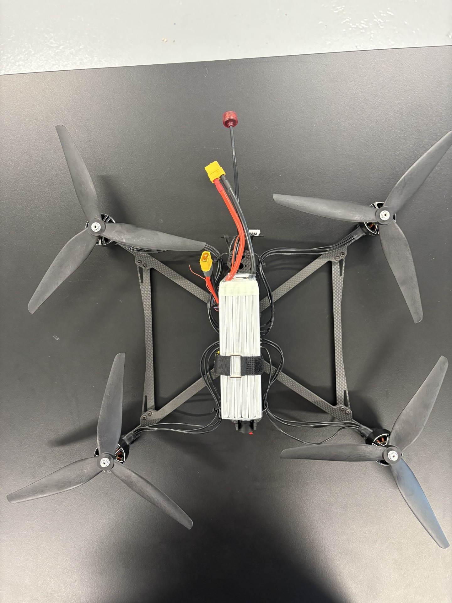
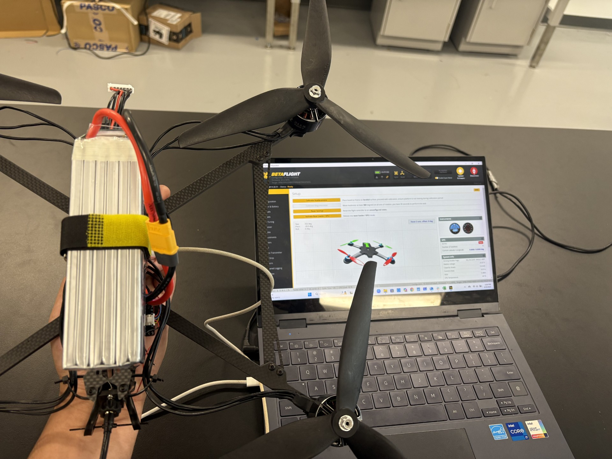
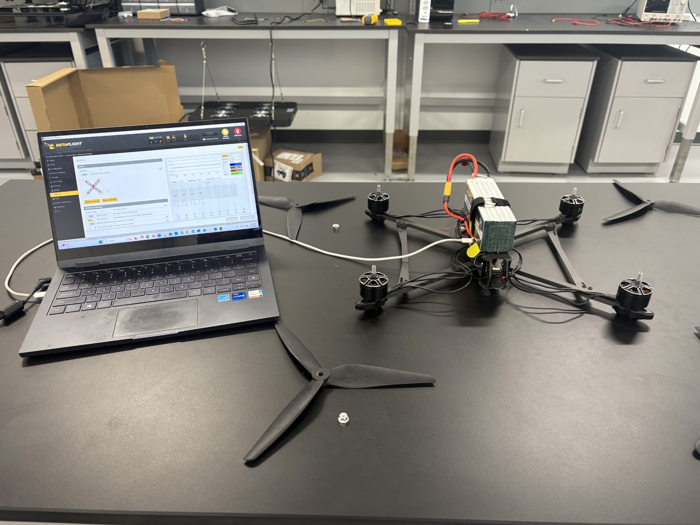
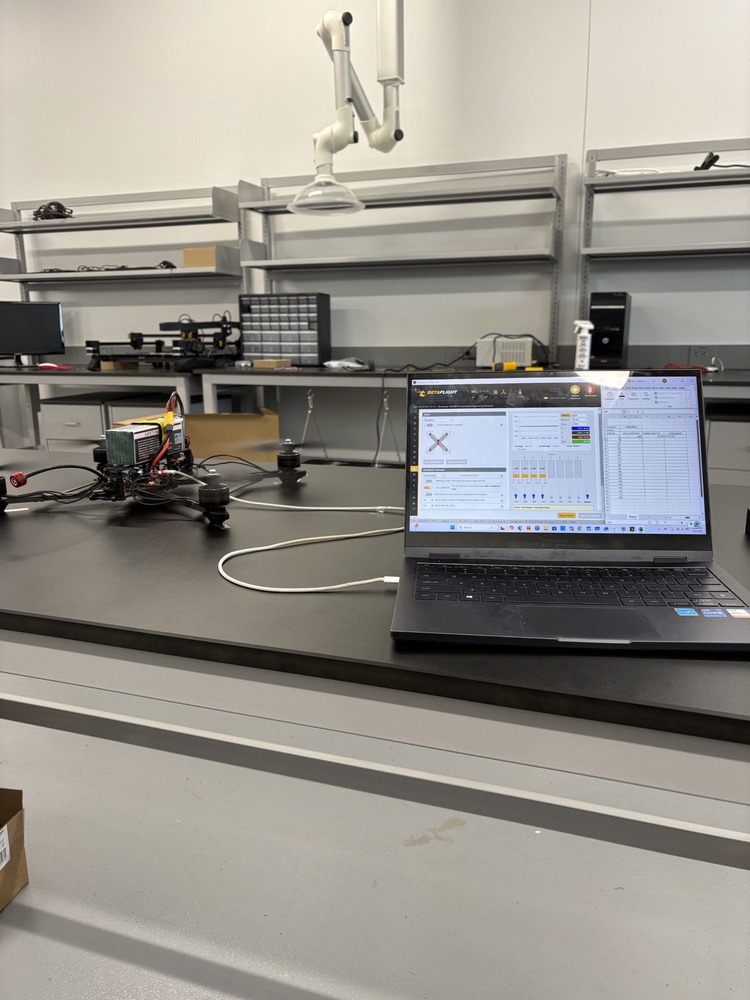
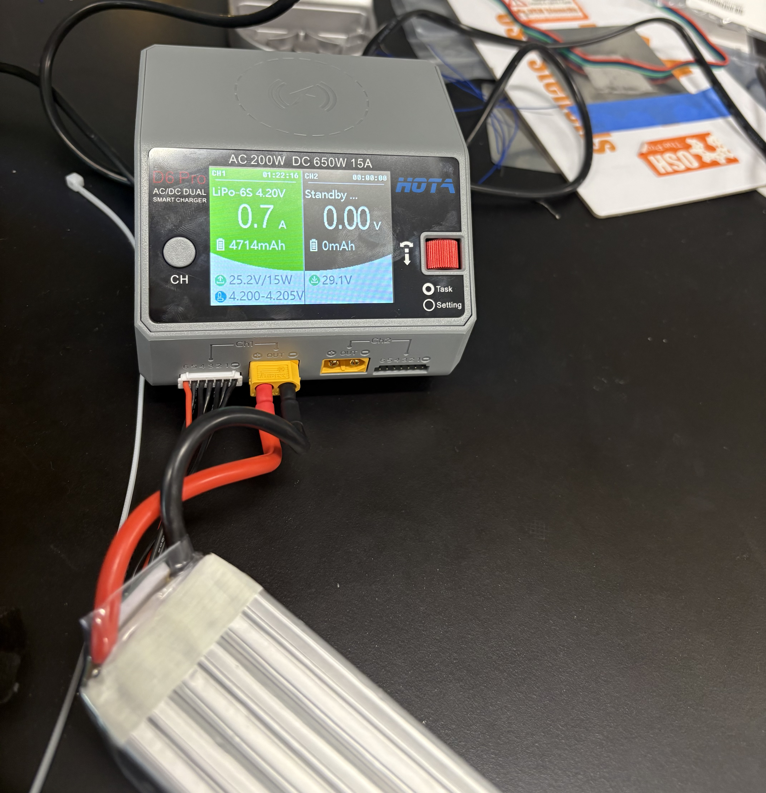
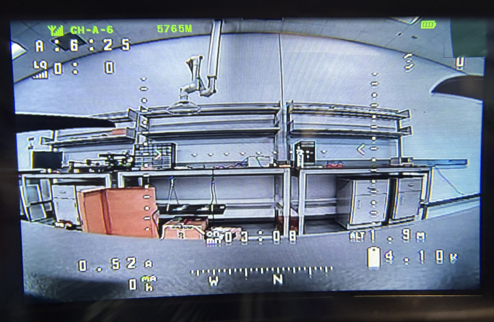

# 10-Inch Drone Assembly and Setup

My job has been to assemble and configure the drone, which will be used in later parts of the project. I began by putting together the bottom of the drone. It consisted of attaching the bottom plates, arms for the propellers, and small pillars that would hold the top plate.  

  
For the top of the drone, I needed to attach the camera and antenna mounts as well as the top plate. I also added the accessories to the arms, which raised it from the ground.The skeleton of the drone was now complete with these parts attached.   

  
I began to add the components that needed to be soldered to the drone. First I screwed the motors on the arms. Separately, I soldered the capacitor and wires for the battery onto the bottom of the stack. Once they were attached, I placed them within the drone and soldered the motors on.  

  

The next step was to attach the top of the stack in order to be able to start adding all the different components. I started with the transmitter by soldering the wires onto the top of the stack. I also attached the antenna to the mount and to the transmitter. Once the transmitter was complete, I began to solder on the wires for the receiver. The receiver also had an antenna I had to place on the mount.    

  

The last component I soldered was the camera. I first attached it to the camera mount using screws and then I soldered the wires onto the stack.   

  

To finish assembling the drone, I attached the propellers in their proper place and strapped on the battery. I also used some zip ties to make sure the wires would not be cut by the spinning propellers. There is an additional zip tie on the battery cable as well, so it is out of the way.   
 
    

By connecting the drone to my computer with a usb c cable, I could start setting up the software of the flight controller. Once the drone appeared on the flight configurator, it confirmed that the drone was recognized. I calibrated the accelerometer and moved the drone around to confirm that the motion of the drone was being captured.  

  

Within the motor tab of the BetaFlight configurator, it contains a graph that shows various information about the drone. It shows the degrees per second that the drone is rotating around each axis. The X represents roll, the Y represents pitch, and the Z represents yaw. It can be scaled to be as small as -1 to 1 degrees per second, to as large as -2000 to 2000 degrees per second. Below the graph, there is additional information. It includes the total real-time voltage of the battery, the real-time amperage that is being drawn from the battery, as well as the total milliamp hours drawn from the battery from the time of connection. Below these labels, there are columns for each motor. You can see the Pulse Width Modulation signal being sent to each motor. 1000 represents 1000µs, and it is the minimum possible value with the motors at rest. It goes up to 2000, which represents 2000µs, and it is the max setting for the motors. Each motor can be controlled separately with the respective slider, or they can all be controlled at once with the master slider. There is also an R and T, which denote the RPM and temperature of the motors, respectively.    

  

I detached the propellers for safety and began to set up the software for the flight controller. I configured the motors to spin the correct way, as well as settings for the transmitter and camera.   
 
  

I switched to testing for battery performance. At first, I connected the drone and set the throttle to 15% through my computer and tracked the amps drawn every 3 minutes. After half an hour, only 971 mAh had been drawn from 5000 mAh. I decided to stop the test then, as it would take too long to deplete the battery. I realized that by not having the propellers attached, the motors do not encounter any resistance. For the second test, I decided to increase the throttle to 20%. I also attached the propellers by placing them on opposite sides so they would be pushing the drone down. With this test at the half-hour mark, 2530 mAh had been drawn, which is considerably more than the first test. At this point, I increased the throttle to 30% to deplete the battery faster. At around minute 43, the motors decreased speed by themselves. I let them run until minute 46 when the motors stopped by themselves. At the end, the drone drew 4193 mAh.  

    

once the battery was depleted I waited for it to cool down. After a couple of minutes the battery cooled down enough for me to plug it into the charger. The battery took 1 hour and 22 minutes to charge back up.    

  

I configured the on-screen display through the beta flight configurator. I first picked the setting I wanted to appear in, and then I placed them in an appropriate spot. Once I picked the correct video format and saved all, I needed to do was set up the goggles. First, I connected the antennas to the drone. AFter that, I looked through the various channels and bands in order to find the ones that matched the video transmitter. Once I found the matches, I could see through the drone camera with the goggles. In the on-screen display of the goggles, I could also see all the settings. I had to edit them in order to make them fit into the screen. The settings I decided to include are altitude, artificial horizon, artificial horizon sidebars, battery average cell voltage, battery current draw, battery current mAh drawn, compass bar, link quality, throttle position, timer 1, and the vtx channel.    
  

   
 