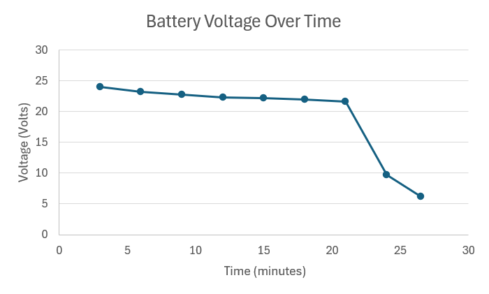

I tested the perfomance of the 5000 mAh lipo battery being used for the 10-inch drone. An in depth explanation of the test can be found in `10-Inch Drone Assembly and Setup`.

The amps battery amperage describes the current being drawn from the battery in real time. On the x axis it has time in minutes and in the y axis it has amperage in amps. The current being drawn depends on the load being applied to the battery. A higher load like flying with a heavy payload will draw more current. During a real flight the current being drawn would not stay consistant throughout the duration of the flight. However for this test I kept the drone at 30% throttle so the load was kept consistant. It had a maximum value of 11.975 amps and steadily decreased to 10 amps. It had a sudden drop at minute 21.
   

  

  
