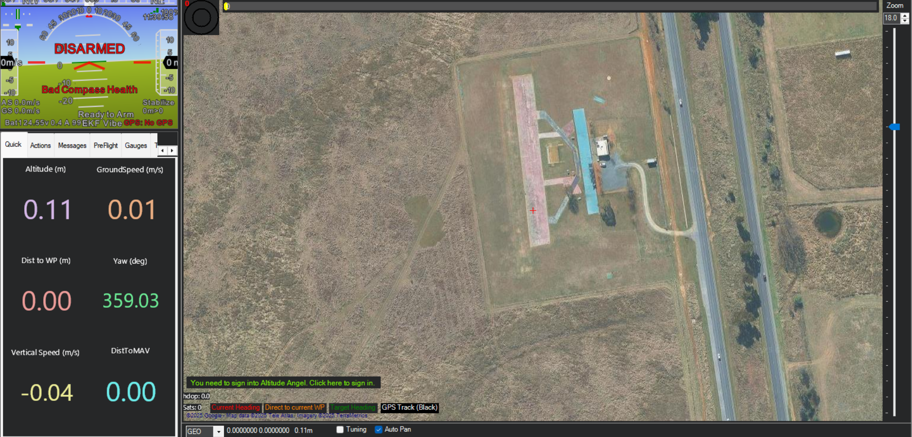
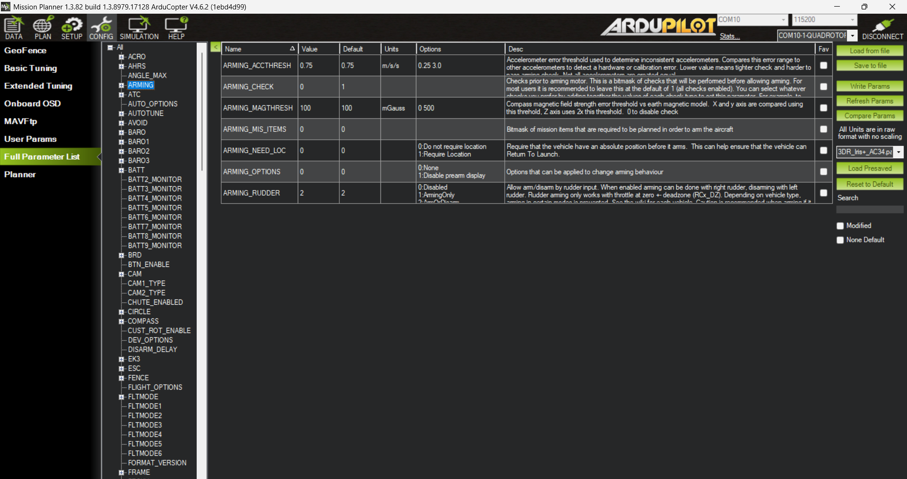

# Ardupilot 

Ardupilot is compatible with the speedybee f405 v4
[f4 v3/v4](https://ardupilot.org/copter/docs/common-speedybeef4-v3.html)
ardupilot can not use the bluetiith module in the fc. May need a separate radio.

[f4 v3/v4]https://ardupilot.org/copter/docs/common-telemetry-landingpage.html#common-telemetry-landingpagel)

current list of things connected to fc:
trasnmitter
reciever
camera 
esc-bottom

additions to fc:
pi(seperatly powered?)
radio

needed to flash noobs card with rasberyy pi os
downloaded imager
pluged sd card inot computer
flashed
https://www.raspberrypi.com/software/

may need to add files manualy
may need to connect to a non 5g netwrok

had to do a lot of work around.
used the monitor and enabled ssh

ping 100.65.46.38
can not ssh normally i must use ssh pi@100.65.46.38
username-pi
password-pi

mkdir ~/ardupilot
cd ~/ardupilot
python3 -m venv mavproxy
source mavproxy/bin/activate

installed mavlink 

pip install MAVProxy

mavproxy.py --master=/dev/serial0 --baudrate 115200 --aircraft MyCopter

param set SERVO1_FUNCTION 33
param set SERVO2_FUNCTION 34
param set SERVO3_FUNCTION 35
param set SERVO4_FUNCTION 36
param save
reboot

motortest 1 0 20 2

arm throttle 

disarm throttle

https://ardupilot.org/dev/docs/raspberry-pi-via-mavlink.html

https://www.docs.rpanion.com/software/rpanion-server

https://mavlink.io/en/mavgen_python/

non_gps guided flight
https://ardupilot.org/copter/docs/common-non-gps-to-gps.html