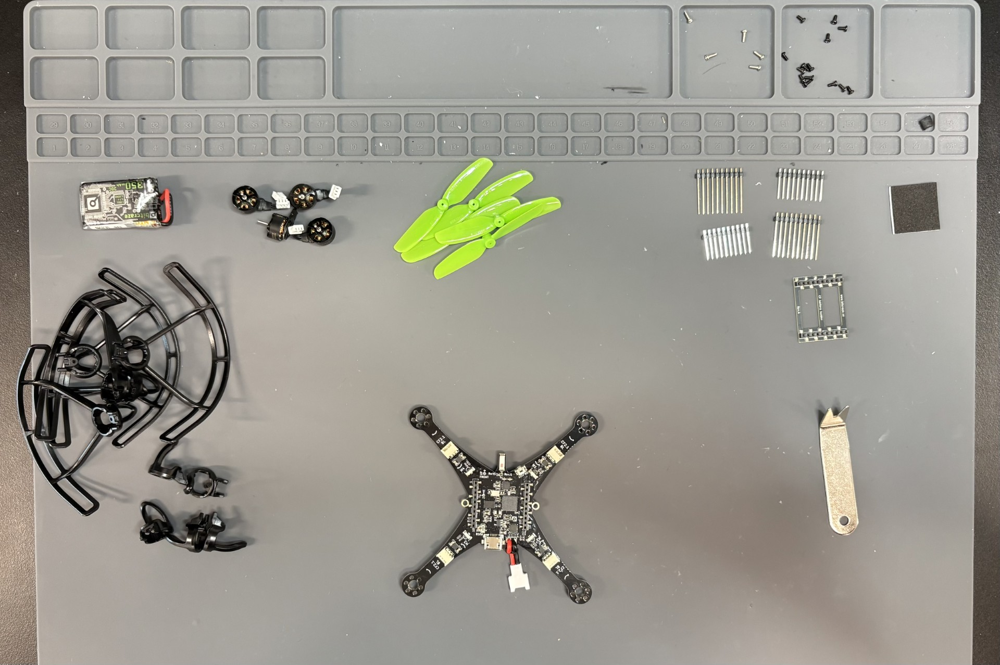
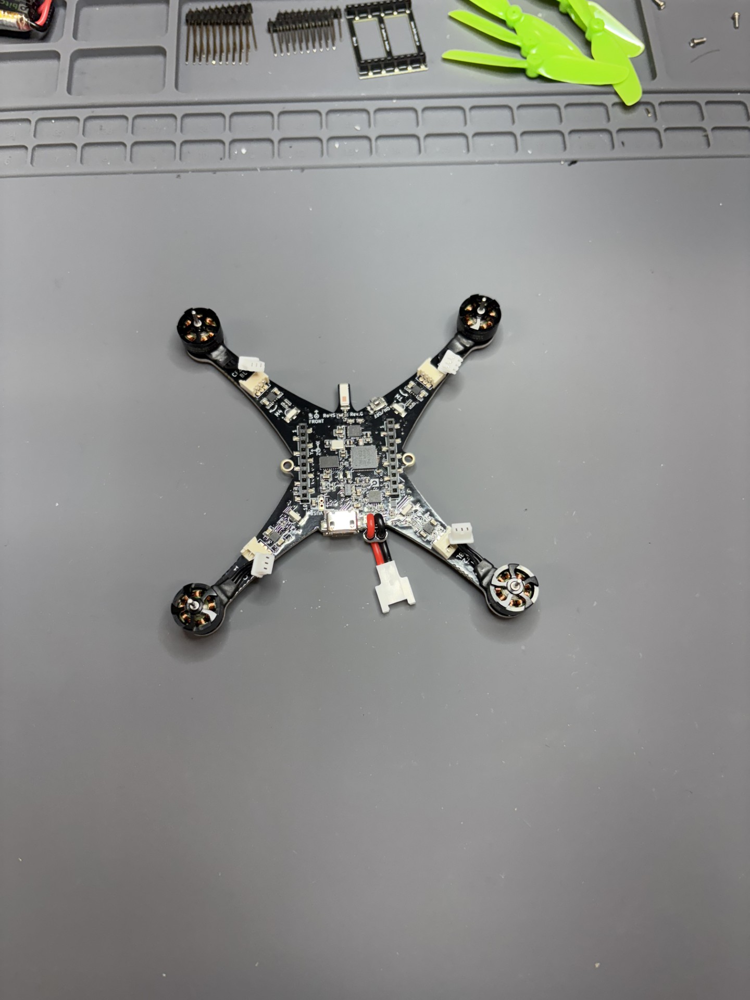
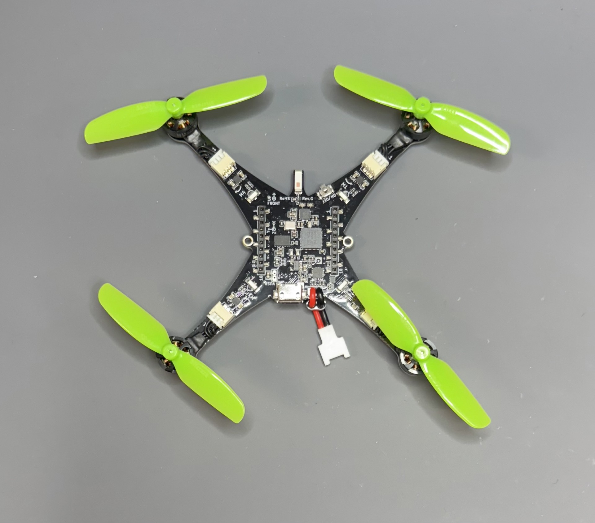
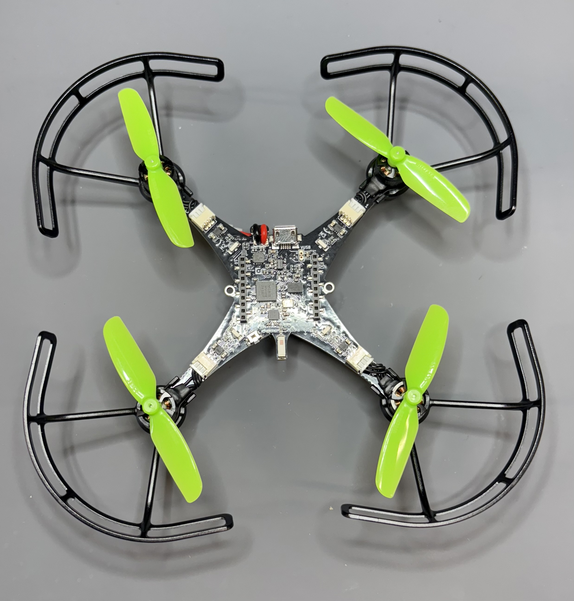
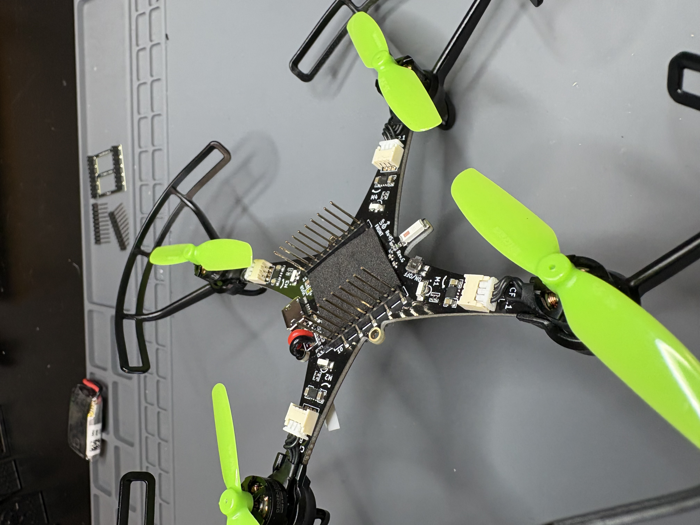
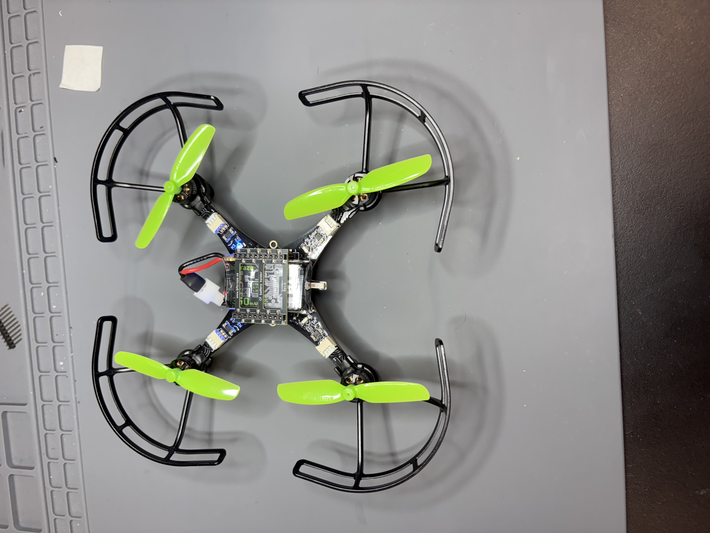
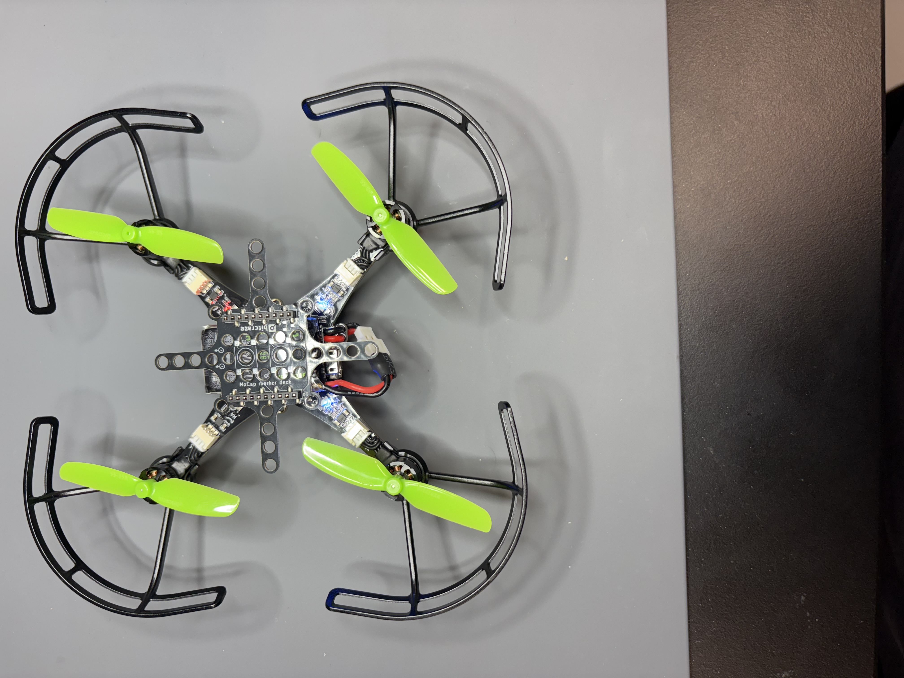
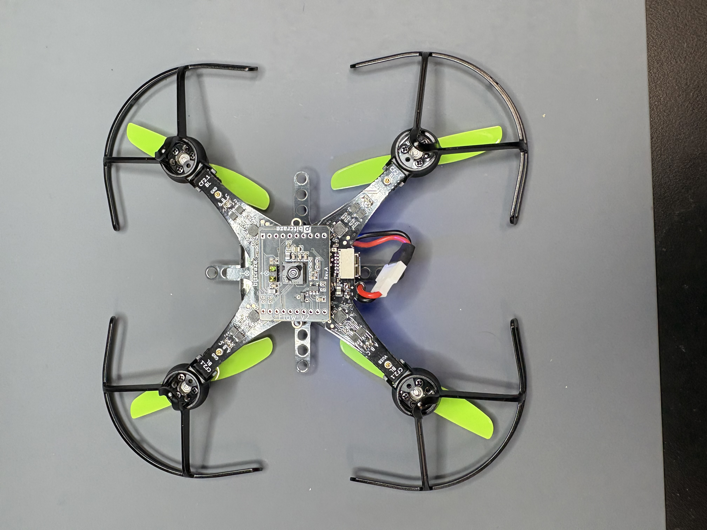
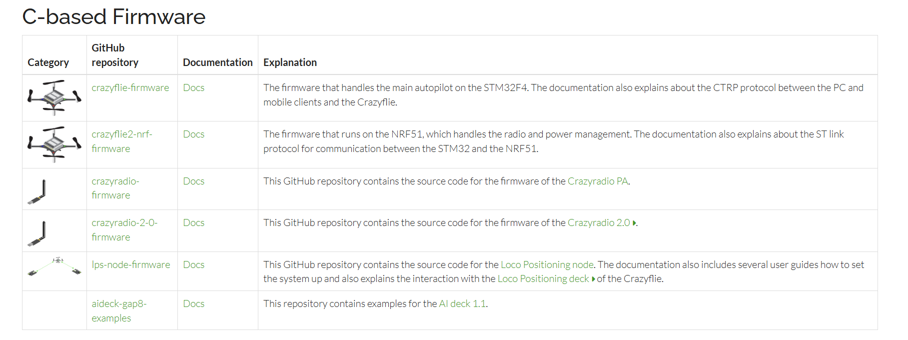
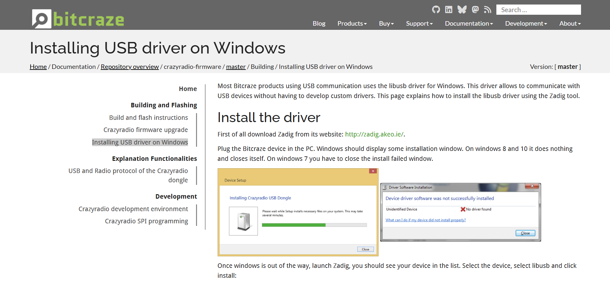

# Crazyflie Assembly and Setup  

The Crazyflie 2.1 brushless is a variant of the original Crazyflie 2.1, replacing the motors with a brushless version. It measures around 80.7x80.7 millimeters without the propellors and weighs around 40 grams. It can fly up to 10 minutes and is powered by a STM32F405 microcontroller. It is an open source platfrom with a lot of room for customization through expansion decks. For this project we will be using a mocap deck and a flow deck.
<br><br>

The assembly of the Crazyflie was fairly straight forward. There was no soldering required for the assembly. The Crazyflie came with everything needed to use the drone apart from the crazyradio2.0. A complete list of included parts can be found in the Bitcraze website.
  
<br><br>

The first step for asse,bly was attaching the four 08028-10000kv motors. They needed to be screwed in through the back of the base and plugged in the provided inserts. The plugs for the motors also need to be rotated by 180 degrees in order to fit in the inserts.
  
<br><br>

The second step is attaching the propellors to the drone. The propellors for the drone come in two variants. There are clockwise propellors denoted by a "55-35R" and counter clockwise propellors denoted by a "55-35". Clockwise propellors must be placed on the top left and bottom right motors with respect to the front direction. Counter clockwise propellors must be placed on the top right and bottom left motors.
  
<br><br>

I opted to attaching the guards to the drone as opposed to using the legs in case of a crash. They simply clip on to each leg of the drone. The assembly manual advices againts screwing in the guards as it may damage the drone in a crash.
  
<br><br>

I stuck the battery pad on the top of the drone in order to provide friction fro the battery. I also went ahead and attached the headers. Since we will be using expansion decks I used the long pair of headers. All I had to do was insert them from underneath the drone through the small holes on each side of the drone.
  
<br><br>

Finally I connected the battery and placed it in between the headers. I also attached the battery holder on top of the battery. This is what the Crazyflie would look like with no expansion decks. However, we will be using mocap deck so I needed to remove the battery holder.
  
<br><br>

I replaced the battery holder with the mocap deck. It has small arrows to indicate the front and top of the mocap deck in order to assemble it properly. It attaches to the headers the same way as the battery holder.
  
<br><br>

the final step for the assembly of the Crazyflie was to add the flow deck to the bottom of the drone. With the flow deck the drone is able to detect its motions. It makes it easier to fly with assisted hovermode and follow preprogramed paths.
  
<br><br>

The first step for the setup was to clone the client repository. It can be found in the repository overview page.
 
<br><br>

Once the repository was cloned and the content was installed I could open it using the `cfclient` command
```
cfclient
```

The next step was to set up the CrazyRadio. The first time I plugged in the radio I was prompted to download the firmware. I then dragged the file into the radios folder. It then rebooted by itself. The firmware for the CrazyRadio can also be found in the repository overview page.
 
<br><br>

Lastly I needed to install the driver for the CrazyRadio. I installed zadiq, the link to install can be found on the "Installing USB Driver on Windows page". You need to make sure to choose the "libusb-win32" option.
 
<br><br>