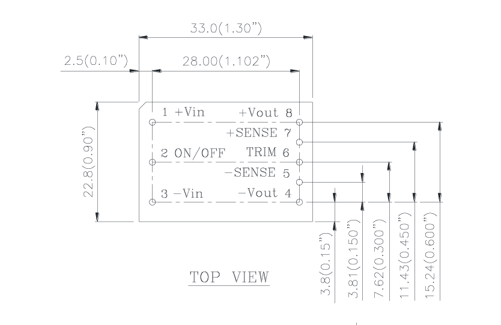
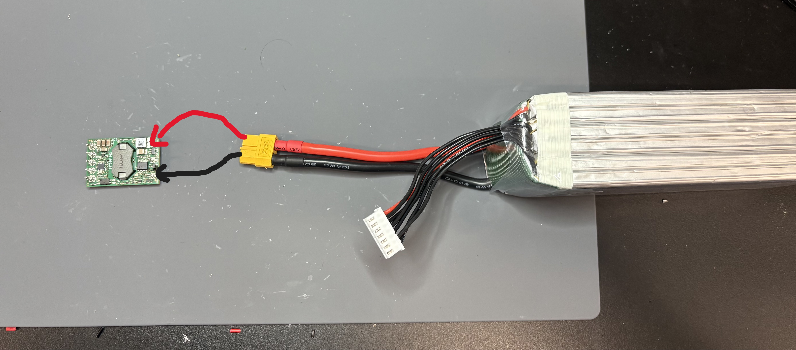
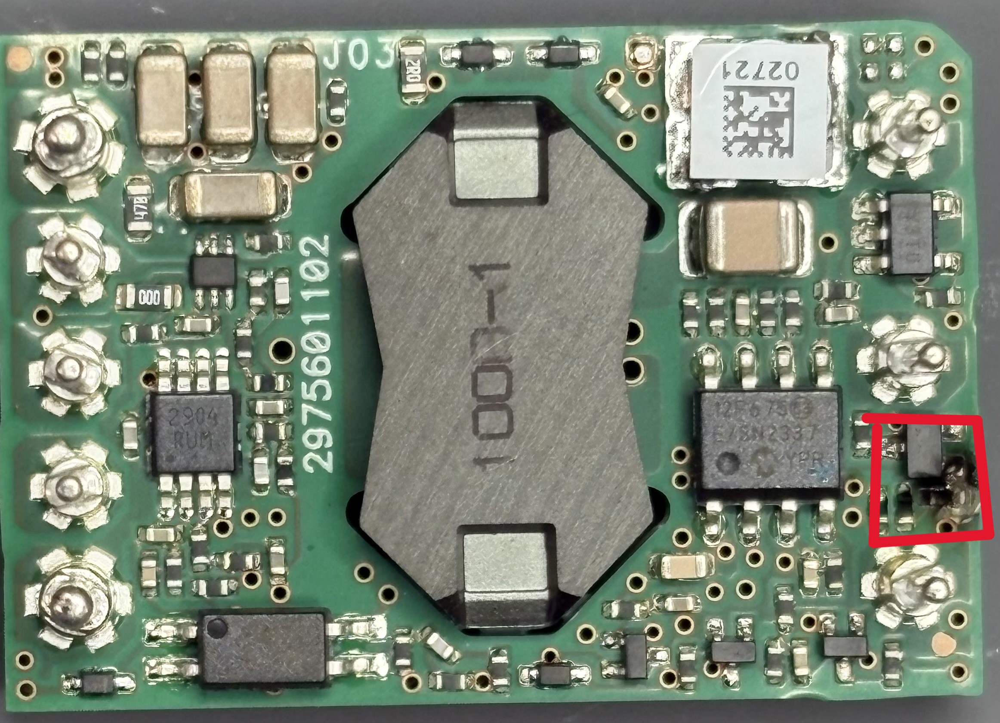
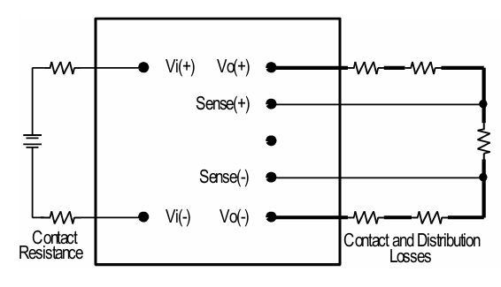
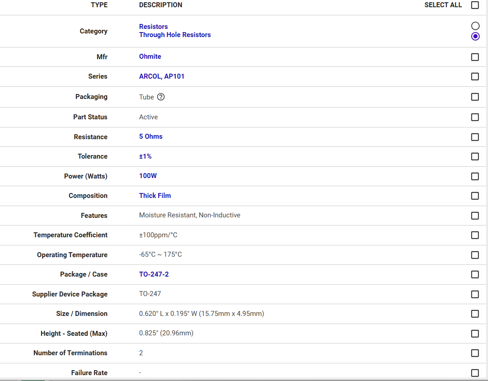
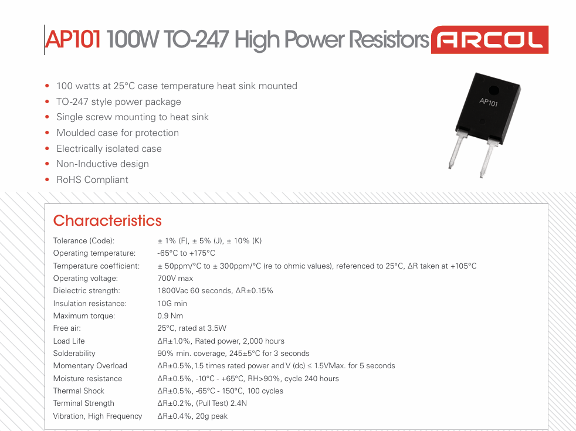
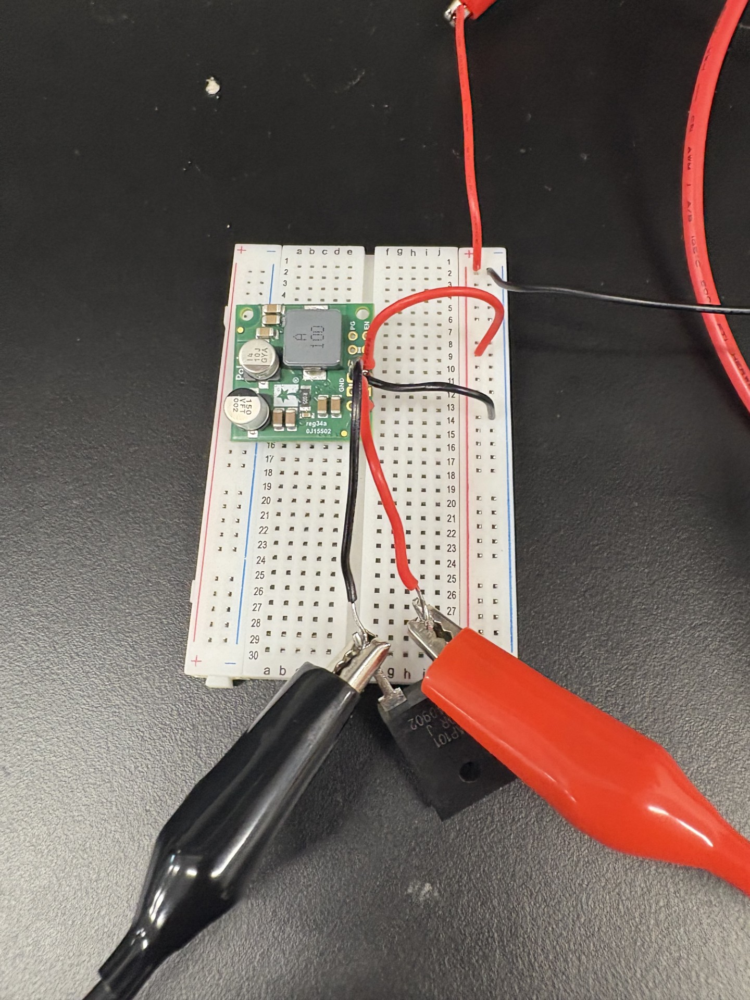

add:
drone crash
buck converter
capacitor test

For my initial set up to test the V36SE12005NRFA buck converter I connected a 5000 mAh battery with alligator clips to the baord. I used a multimeter to read the output voltage. The goal of the test was to see whether the buck converter reduced the voltage to 12v. 

I connected the positive lead of the battery to +Vin and the negative lead to -Vin

As a result a part of the buck conveter sparked and popped. It left visible damage on the converter.  

For the second set up I looked at the datasheet for the buck converter and followed the provided wiring diagram.
  
I connected the sense + and sense - pins to Vo+ and Vo- respectivly. I also connected the on/off pin to the -vin pin.

  

### Resistor

In order to test the buck converter with a load I attached a resistors of different values to act as a load. They were 5, 10, 82, and 91 ohm resitors, each rated at 100w. I connected them to the output of the buck converter and measured the voltage as well as the current through the resistors. I began with the 91 ohm resitor, using voltage values of 19.8, 21.6, 22.2, and 25.2 volts. This was followed by the 82 ohm resistor, which was also tested at said voltage values. When it was time to test the 10 ohm resistor I noticed smoke rising from the resistor as well as popping sounds. I turned off the power supply and checked on the resistor however it was hot to the touch. I double checked my connections and math afterwards. The connections seemed to be fine. With 18v flowing through the resitor it should draw 1.8 amps. This brings the power dissipated by the resistor to around 32 Watts. The resistor is supposed to be rated for 100 Watts so I checked the data sheet.   

On the website it states its rated for 100 Watts. However, if you look into the data sheet it specifies thats the rated power with a heatsink.Without a heatsink the resistors are only rated for 3.5 Watts. This was fine for the previous resistors as the power dissipated was close to 3.5 Watts.   

I also double checked to make sure it was a 10 ohm resistor using the multimeter. 

