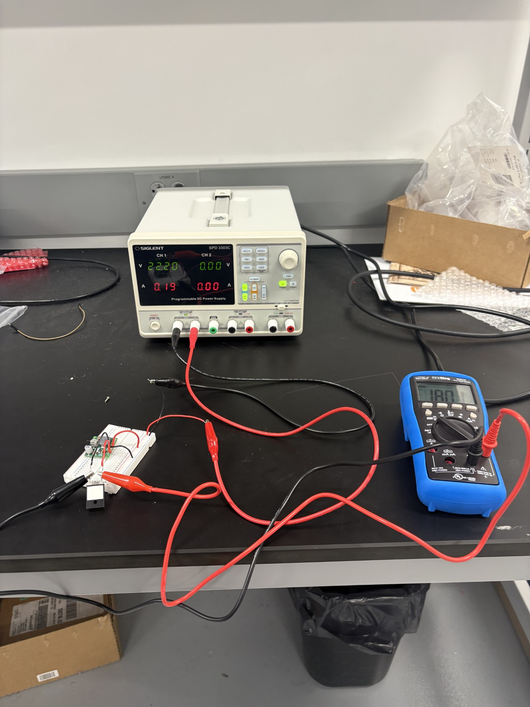
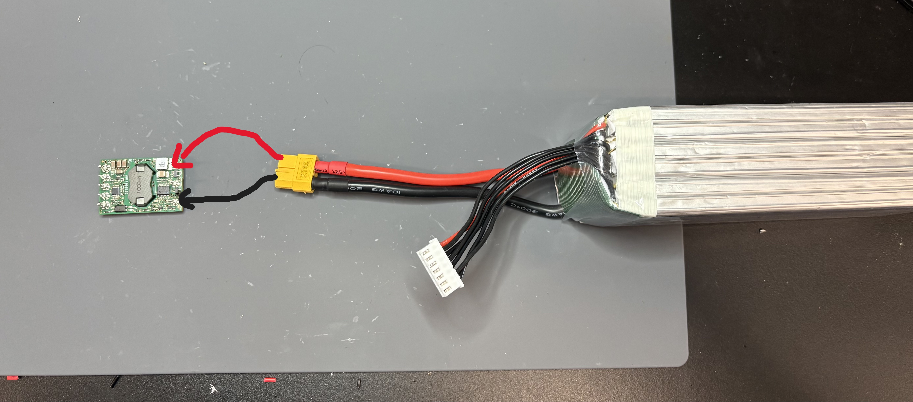
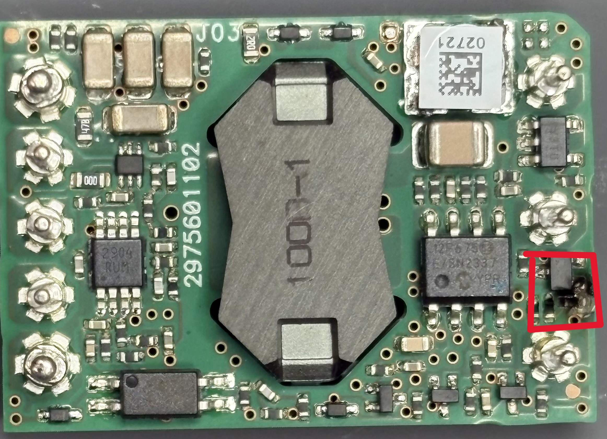
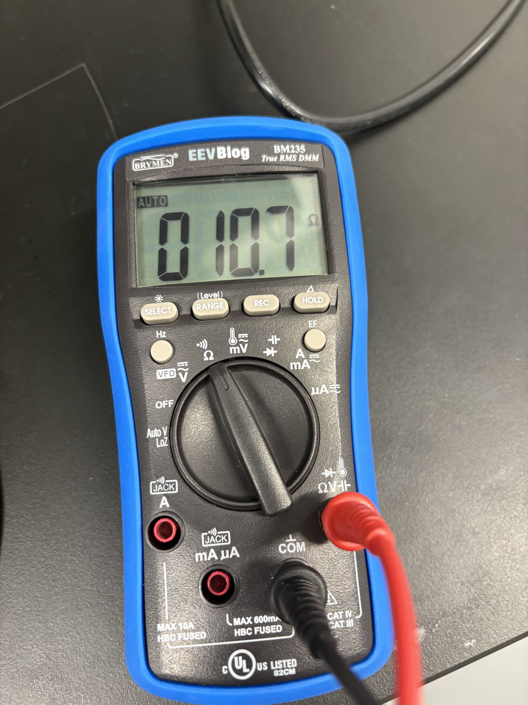

add:
drone crash
buck converter
capacitor test

For my initial set up to test the V36SE12005NRFA buck converter I connected a 5000 mAh battery with alligator clips to the baord. I used a multimeter to read the output voltage. The goal of the test was to see whether the buck converter reduced the voltage to 12v. 
  
I connected the positive lead of the battery to +Vin and the negative lead to -Vin

As a result a part of the buck conveter sparked and popped. It left visible damage on the converter.  

  

For the second set up I looked at the datasheet for the buck converter and followed the provided wiring diagram.
  
I connected the sense + and sense - pins to Vo+ and Vo- respectivly. I also connected the on/off pin to the -vin pin.

