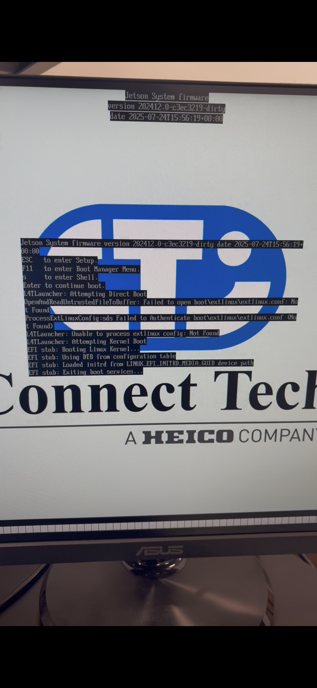

powered buck converter

powered carrier board

installed nx and ssd

downloaded sdk
https://developer.nvidia.com/sdk-manager

ran into an issue with sdk not availible for windows

download ubuntu 
https://ubuntu.com/download/desktop/thank-you?version=24.04.3&architecture=amd64&lts=true  

download rufus
https://rufus.ie/en/  
 

To set up the Jetson Orin NX, I first started by setting up the Boson 22 carrier board. The carrier board will provide power, connections, and memory for the NX module. I started by connecting the carrier board to the bench power without the NX module for a test. I plugged in the power cable to the carrier board and used alligator clips to connect the cable to the bench power supply. The buck converter will output a steady 18V, thus I set the power supply to 18V and .2 Amps. A blue light on the board turned on, and it seemed like it was safe to proceed.   
 
After testing the carrier board, I attached the NX module and the SSD. The NX module needs to be inserted correctly, making sure the module is facing the correct way. There is a small indent in the module and a matching notch on the carrier board. If you align the notch and indent, then the NX module will be facing the correct way. Once the module is inserted, it should rest at an angle from the board. All you have to do is push down on it, and it will click into place. The SSD is very similar, although you also need a screw to hold it in place. In the Boson 22 documentation, it states to use M.2 screws for the SSD. M.2 screws did not work as they are too small, and I had to use an M.3 screw to hold down the SSD.  
 
I made an Nvidia account and downloaded the Nvidia SDK Manager. I downloaded the Windows version of the manager, which led to an issue. There are no available versions of the SDK for Windows 11, so I could not proceed.   
 
In order to solve this problem, I decided to boot Ubuntu on my computer via a USB drive. I encountered this problem since I have a Windows laptop, but if your computer uses Linux, then you would not run into this problem. I downloaded Ubuntu 24.04.03 LTS however, this would also result in an issue.   
 
Ubuntu LTS link  
 
In order to get Ubuntu onto the USB drive, I also downloaded Rufus. I downloaded the Rufus-4.11.exe version of Rufus. With the USB Drive plugged in, I opened Rufus and chose my USB for Device, Ubuntu for boot selection, and GPT for partition scheme. I then clicked start, and it began to copy everything over to the USB Drive. Once it was complete, I could boot up Ubuntu on my laptop.   
 
In order to boot from a USB, you need to plug in the USB drive, then shut down your computer and power it back on while pressing down the boot key. The boot key is different depending on the manufacturer. I am using a Samsung laptop, so my boot key was F10. Once your computer powers on, you will be prompted to a screen that says “try or install” and other options. Use the arrow keys to highlight that option and press Enter. You should now be in the opening screen for Ubuntu.   
 
I needed to redownload the SDK manager again, so I followed the same steps as before. This time, I chose the .deb Ubuntu version of the manager. You need to go into your files and open the manager with Apps Center and install it. Once the manager is installed, you can open the command line in order to use it. You should be able to run sdkmanager to open the GUI. Unfortunately, my computer can not use the GUI due to the screen resolution. If you also run into this issue, you can run sdkmanager --cli to use it in the command line.   
 
Once you run that, you should see a welcome message. You will be prompted to choose a login type, choose the developer login. You will see a QR code, once you scan it, you can log in on your phone, and it will automatically log you in on the computer. After that, you can choose install for the action, Jetson for the product, Ubuntu as the system configuration, Jetson Orin NX Modules for target hardware, and Linux for the operating system.  
 
At this point, I ran into a problem as the version of Ubuntu I downloaded is not supported. I believe this will be a simple fix by downloading a different version of Ubuntu.   
 
https://medium.com/@fixitblog/solved-linux-doesn-39-t-save-changes-7a0ea7075011

  

When using a carrier board that is not the standard board included in the devkit, the sdkmanager can not be used to flash the nx. You must manually flash the module following the guide provided by your carrier board manufacturer. In our case we are using a Connect Tech Boson22 for orin. Thus I will follow the guide provided by Connect Tech.  

https://connecttech.com/ftp/Drivers/L4T-Release-Notes/Jetson-Orin-NX-Orin-Nano/ORIN_NX_NANO-36.4.4.pdf  
  

The guide provides instructions on how to install the needed BSP and flash the module.

It also refrences another guide for downloading and installing needed portions from the sdk manager  

possible problems:
Board is not in force recovery mode
   - I refrenced the boson22 for orin manual to put it into force recovery mode
   - by using lsusb you can check if the module is in force recovery

Not using a proper data cable:
    -I switched known data cable (cable used for robot arms)

storage may be too full:
    -You can check storgae with df -h
If you moved filed to trash they may not actually be deleted. If items that you deleted are still taking up space you can use `sudo rm -rf ~/.local/share/Trash/*`

attempted solutions-  
swithced usb cable  
switched jetpack version  
flashed as nano is supermode  
switched to server  
sudo apt install nfs-kernel-server -y   

potentially powersupply issue  

 
flashed to emmc  
used sudo ./cti-nvme-flash.sh cti/orin-nx/boson22-orin/base nvme0n1p1  
  