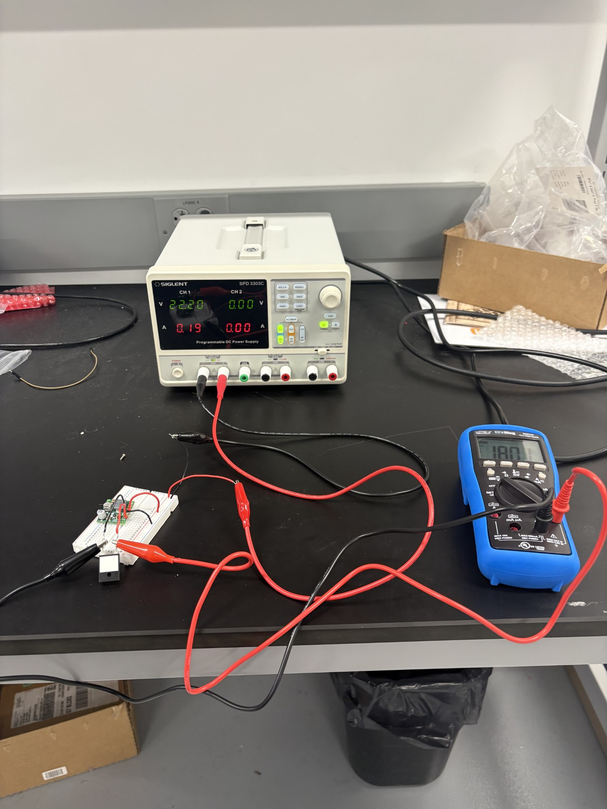
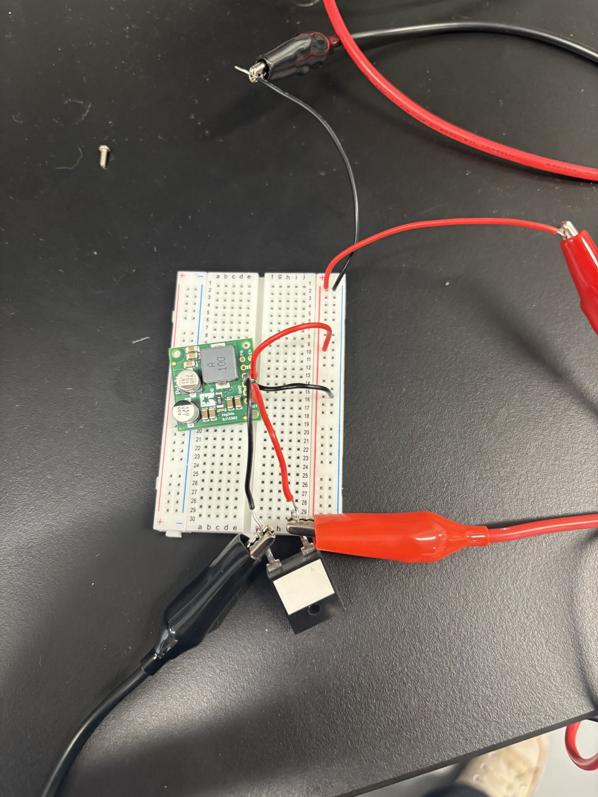

# Optitrack waypoints for drone flight

crazyflie
crazyflie prerequisites

optitrack 
optitrack prerequisites


fidnign forum about config
found instructions about config

found bitcraze vm used bit craze vm but still did not work
updated bitcraze vm
updated bit craze vm still didnt work

found how to proparly build firmware
flased firmware proparly

found code for mocap room
code for mocap room did not work - import issue
installed prerequisites for import
code for mocap room still did not work

used different setting in code for optitrack
code worked

tested it and it performed badly
took off flow deck

code stopped working
switche dip address in motive
code "worked"

In order to begin using waypoints for the crazyflie you must have the python library `cflib` installed. The library requires python 3.10+ to function, however extra steps are needed for python 3.13. I chose to make a conda envirnemnt in order to use python 3.10. You can make a conda environment using:   
```
conda create -n crazyflie python=3.10
```
I named my environment "crazyflie" but you can name yours whatever you want. If you leave and need to activate your environment, it can be done using:
```
conda activate crazyflie
```
 Once you have your environment set up you can isntall the python library. All you need to do is:

```
pip install cflib
```

When researching on how to use an optitrack motion capture room to set waypoints for a crazyflie I came across a forum. It stated that you needed to edit a file named config.mk. I also saw a tutorial on how to do that.

[first forum](https://forum.bitcraze.io/viewtopic.php?t=2964)

[tutorial](https://wiki.bitcraze.io/doc:crazyflie:api:firmware:deck:howto)

[vm](https://github.com/bitcraze/bitcraze-vm)

vm did not have brushless version in the firmware

updated all projects

was flashing firmware incorreclty 

[flashing tutorial](https://www.bitcraze.io/documentation/repository/crazyflie-firmware/master/building-and-flashing/build/#dependencies)

[motioncapture](https://github.com/IMRCLab/libmotioncapture)

nothing would happen in the example code

[example code](=https://github.com/bitcraze/crazyflie-lib-python/tree/master/examples/mocap)

changed optitrack to optitrac_closed_source

still having issues with ip address



